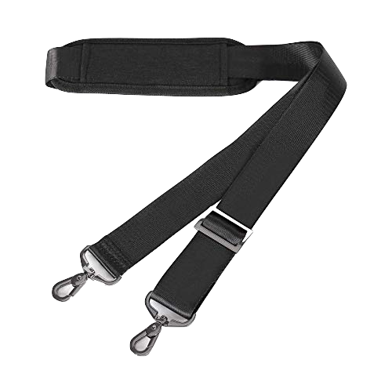
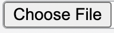

## Bootstrap.

What is bootstrap, and why is it simultaneously so popular and so hated? It is not a physical object. It is an open-source stylesheet that makes your sites look more elegant. Bootstrap is a useful tool for styling an html webpage with set default styles for a variety of classes. For instance, unlike those basic “attach files” buttons you see all over Laulima:

You have these buttons:

So for many basic styles and basic tag types, using bootstrap is convenient. For me personally, I’ve never used bootstrap prior to taking ICS 314, but it has a couple of utilities that I do like.

## What’s the difference between nav, navbar, and navbar-nav?

From both the world-wide web and the common sentiment of my peers, I have heard that bootstrap has too many ambiguous terms and too many classes. The question above is an example of some of the issues I have with bootstrap. It’s similar to the issues I ran into before I learned proper styling of code, when I would give four different variables virtually identical names. Furthermore, the bootstrap library is too vast, and sometimes too specific. Often, searching the world-wide web for certain solutions will not work for the specific problem you are trying to solve, just because of a small difference between the goal of your page and the goal of the page being developed by the person who asked the question. 

In this case, because I cannot resolve these issues, I often resort to just using basic CSS. 

## Future usage

I probably won’t use bootstrap too much in the future. As I mentioned before, I would probably use it for the basic utilities, like making a container, using its text font, using icons, and for developing buttons. But otherwise, the classes are too complicated, the library is too vast, and it is incredibly difficult to find the exact tools for your exact purpose.

So overall, I have a relatively neutral viewpoint on bootstrap.

