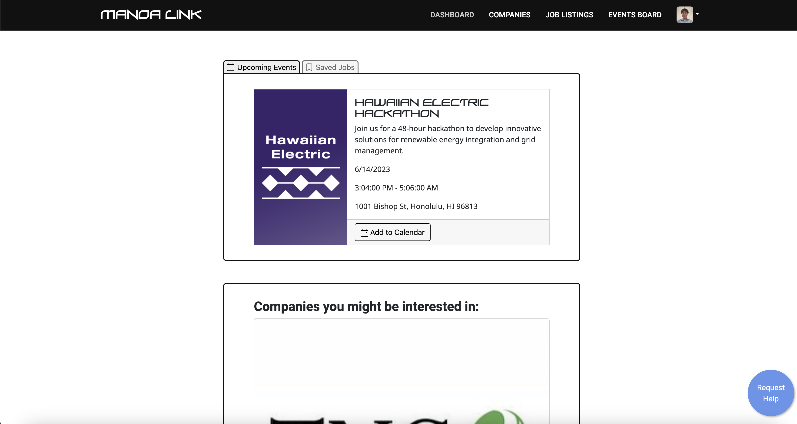
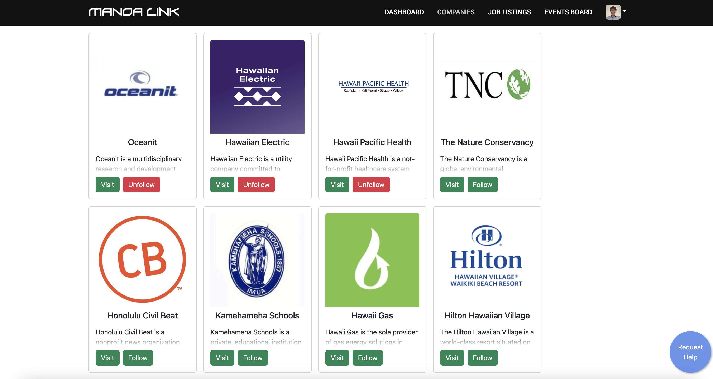
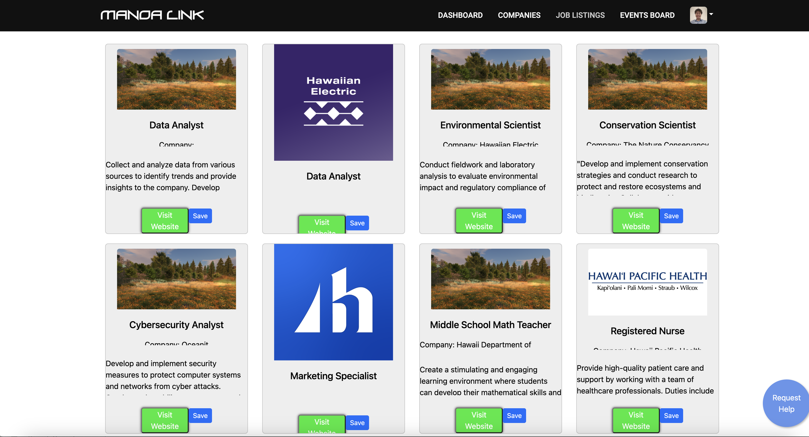

  
  
  

During my Spring 2023 semester, I enrolled in ICS314 (Software Engineering I) at the University of Hawaii at Manoa. For my final project, I teamed up with talented classmates and friends to design [Manoa-Link](https://manoalink.site). The pacing and schedule was very intensive, yet we were able to produce a satisfying result, with pages for student dashboard, company dashboard, company listings, job listings, manage listings, manage events, view events, and more. Further details can be found [here](https://uhmanoalink.github.io/).

The link above provides an in-depth review of my team and our project, but to summarize, our team consisted of Winston Co, Honggun Jeon, Prayag Das, and myself. We used issue-driven project management, and project boards provided by GitHub, to organize our work. Our entire project was broken down into three different milestones, with each one building off the last. Through Meteor, we practiced both front-end design using React, and back-end design using MongoDB. We also implemented tests for every feature we added.

### Project Layout

We primarily planned out our project design using Figma. We also had a shared google doc where we discussed interfaces and APIs that we would use for the site, alongside our team contracts or anything else we needed to discuss. We were all readily available through discord, so we set up our own discord channel dedicated to making progress on the site. One of my team members set up a scheduling bot to notify/remind us of when we need to have a team meeting to discuss recent changes, future changes, plans, merge conflicts, etc.

### My Contribution

My contribution primarily lies in the pages in the Navbar. As an aspiring full-stack developer, I worked in both the front end and the back end, by setting up APIs and reading from the database, while also designing cards for companies and a friendly user interface. My primary contributions were the listings pages, which displays companies and jobs, and also subscribes to the databases and grabs any necessary data. I also set up some API, created default data, and thought up some of the information we'd need for each user and card. Aside from those pages, I also helped my teammates by debugging issues on their pages and branches.

The pages I primarily worked on are in the images above.

### What I would do differently next time

If I had to do anything differently the next time I had the chance to work on this team project, I would simply have put less on my plate. Although I felt that I contributed a solid share, I firmly believe that I could have done more. The time I lacked were spent towards other courses, such as ICS311, ICS212, MATH307, and my Chinese course, while also working 2 part-time jobs and being involved in a couple of extracurricular activities. I do hope to take ICS414 sometime in the future and get another chance to work on a collaborative software engineering project, and when the time comes, I'll definitely have learned my lesson and freed up my schedule a bit more.
