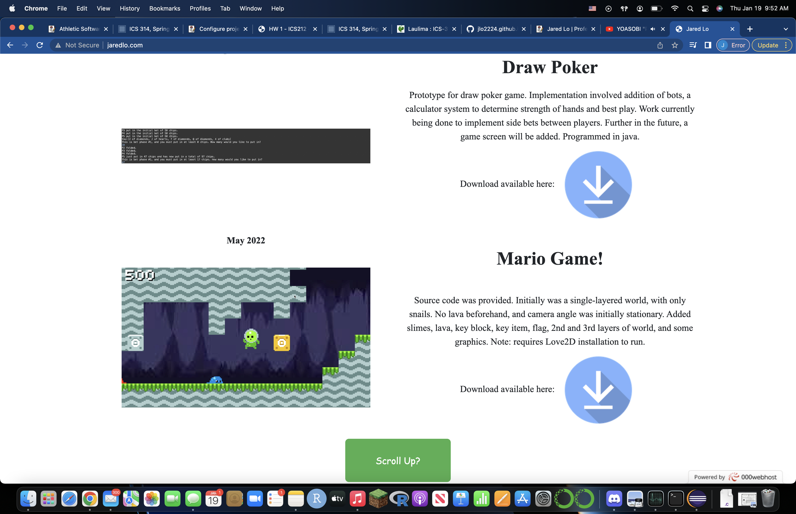

  
  
  

During my Spring 2023 semester, I enrolled in ICS314 (Software Engineering I) at the University of Hawaii at Manoa. For my final project, I teamed up with talented classmates and friends to design [Manoa-Link](manoalink.site). The pacing and schedule was very intensive, yet we were able to produce a satisfying result, with pages for student dashboard, company dashboard, company listings, job listings, manage listings, manage events, view events, and more. Further details can be found [here](uhmanoalink.github.io/).

The link above provides an in-depth review of my team and our project, but to summarize, our team consisted of Winston Co, Honggun Jeon, Prayag Das, and myself. We used issue-driven project management, and project boards provided by GitHub, to organize our work. Our entire project was broken down into three different milestones, with each one building off the last. Through Meteor, we practiced both front-end design using React, and back-end design using MongoDB. We also implemented tests for every feature we added.
