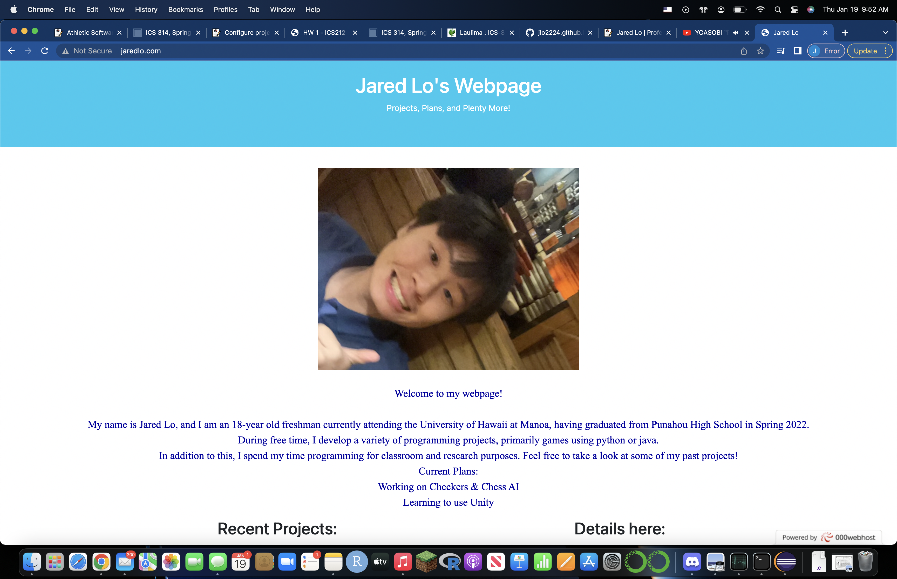
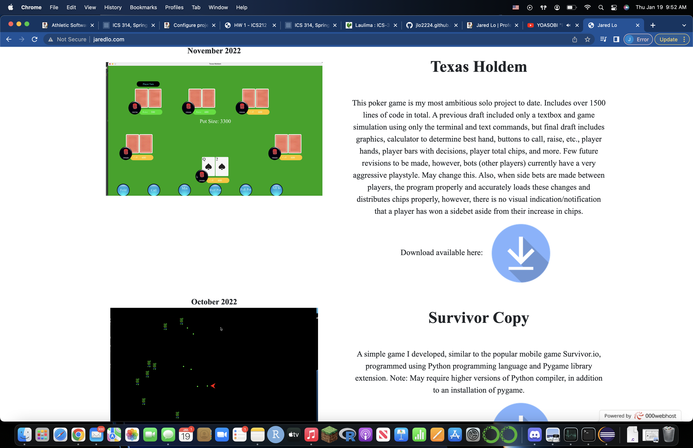
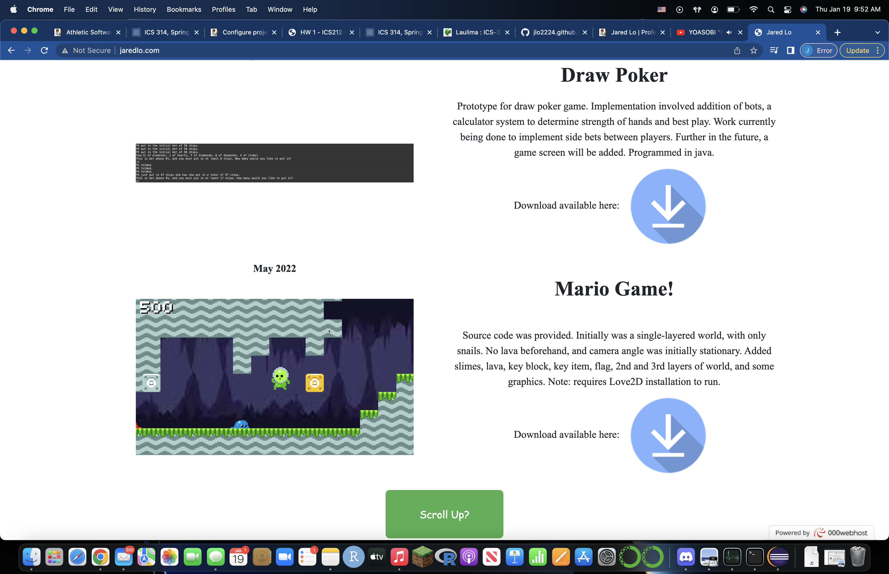

<div class="text-center p-4">
  
  
  
</div>

During November of 2022, I developed a site to practice my skills using HTML and CSS. Prior to this, I have had light experience working with HTML, CSS, Flask, etc. during my time taking the CS50 course offered by Harvard, while writing a "Finance" page. Unlike the page and source code used in that class, however, this project was done entirely on my own (with the exception of some of the images). Note that despite the site being my own, one of the projects listed (specifically the super mario game) was done with source code.

```java
public static int compare(ArrayList<String> hand1, ArrayList<String> hand2) {
	if (value(hand1) > value(hand2)) {
		return 1;
	} else if (value(hand1) < value(hand2)) {
		return -1;
	}
	int[] h1 = highCard(hand1);
	int[] h2 = highCard(hand2);
	for (int i = 0; i < h1.length; i++) {
		if (h1[i] > h2[i]) {
			return 1;
		}
		if (h1[i] < h2[i]) {
			return -1;
		}
	}
	return 0;
}
```
