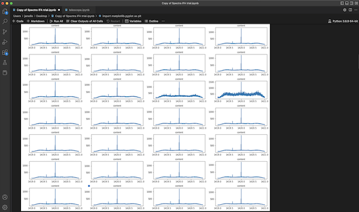
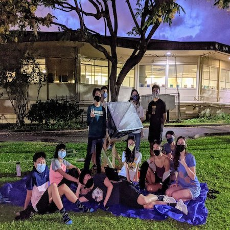

  
  
  

During Summer of 2021, I was part of a team (in my high school) to build a DIY radio telescope using materials that can be gathered from home. In addition to creating the physical telescope with tin foil, styrofoam, copper, wood, etc., we also used a copper nail and aluminum can with measurements of 5.25cm and 10.5 cm to get the open-ended fundamental frequency and close-ended fundamental frequency, respectively, of 21cm wavelengths we were detecting due to the radio waves emitted by the hydrogen spin flip transition. With these tools, we gathered data about the waves we were picking up on, in particular, the direction from which it came from, and how much the measurement differed from the precise value of 21cm. The reason we wanted to find this difference is not because of experimental error, but because we wanted to detect redshift and blueshift from waves. Redshift and blueshift occurs when not only the wave is moving, but also the source, thus the velocity experienced by an observer at rest is slightly off from the actual velocity. So when we compute this difference, we cna reverse-engineer it to find exactly how quickly the source was moving. The source is from a hydrogen cloud from some direction (depending on where we were pointing the telescope), and using a collection of data including the directions and speeds of hydrogen clouds form various datapoints, we could achieve our end goal of computing the rotational velocity of the galaxy.

The images attached above shows data about our waves formatted into a graph using Python and the matplotlib library. We used a software that logged data into csv files every several miliseconds, and part of my role as a member of the team was to debug the code, analyze the graphs, etc. 
For instance, one of my tasks was simply to take a Reimann sum of the Hertz frequency of waves above an x-axis of temperature.
