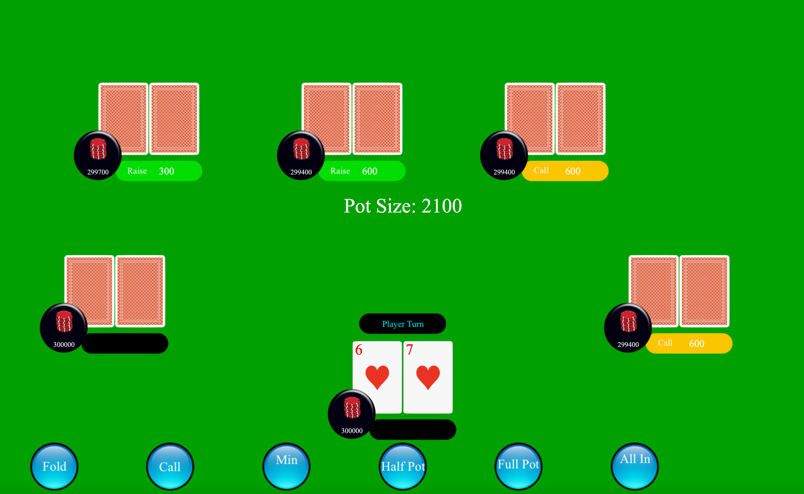
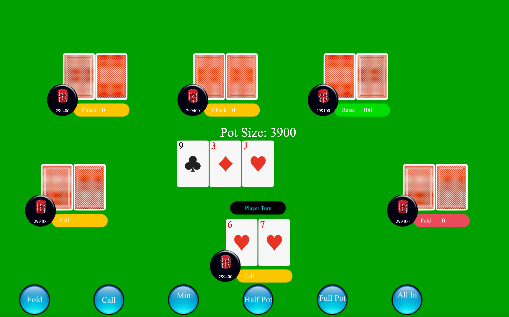
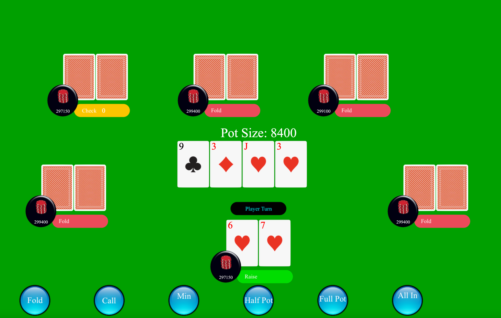

<div class="text-center p-4">
  
  
  
</div>

This is a standard Texas Holdem poker game written with Java. Certain images, specifically the spade, heart, diamond, club, card back, empty card front, buttons, and chips were taken from the world wide web, and others such as the colored numbers/letters, green background, and text came from the Java JFrame library.

With over 1700 lines of code (after several revisions to shorten the code), rapid runtime, and decent graphics, this is my most ambitious solo project to date. I wrote many different classes for this project, including my Main class, Self class, Player class, Deck class, and Calculator class. Here is a sample bit of code to show just one of the many methods I wrote for the Calculator class (used for computing values of hands and comparisons), which is it's comparator compare method. The value() function used in here is another static method I wrote within the Calculator class. 

```java
public static int compare(ArrayList<String> hand1, ArrayList<String> hand2) {
	if (value(hand1) > value(hand2)) {
		return 1;
	} else if (value(hand1) < value(hand2)) {
		return -1;
	}
	int[] h1 = highCard(hand1);
	int[] h2 = highCard(hand2);
	for (int i = 0; i < h1.length; i++) {
		if (h1[i] > h2[i]) {
			return 1;
		}
		if (h1[i] < h2[i]) {
			return -1;
		}
	}
	return 0;
}
```

Some notes: There are just a couple of small "bugs". It's not so much a bug, but a misunderstanding on my part about how the game is supposed to function. See, I initially thought that when a player goes all in, and two other players begin making a side bet, I thought that if one player folded the side bet, they would still be able to claim winnings from the main pot. However, I was wrong about this, so when I implemented this in Java, it did not match the standard rules for Texas Holdem. Other than this, there are not any major bugs.
